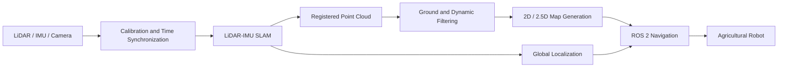

## Hi there 👋

<!--
**Aldoubt/Aldoubt** is a ✨ _special_ ✨ repository because its `README.md` (this file) appears on your GitHub profile.

Here are some ideas to get you started:

- 🔭 I’m currently working on ...
- 🌱 I’m currently learning ...
- 👯 I’m looking to collaborate on ...
- 🤔 I’m looking for help with ...
- 💬 Ask me about ...
- 📫 How to reach me: ...
- 😄 Pronouns: ...
- ⚡ Fun fact: ...
-->
# Xuan Yang

**SLAM · Agricultural Navigation · Point Cloud Mapping**

Agricultural robotics developer focused on building reproducible LiDAR–IMU SLAM, point-cloud processing and ROS 2 navigation systems for greenhouse and field robots

My work covers the complete pipeline from sensor integration and offline evaluation to localization, map generation and real-robot navigation

---

## Research and Engineering Focus

* **LiDAR–IMU SLAM**
  FAST-LIO2, FAST-LIVO2, localization, relocalization and trajectory evaluation

* **Point Cloud Mapping**
  Ground segmentation, dynamic-point filtering, PCD processing and 2D/2.5D map generation

* **Agricultural Navigation**
  Greenhouse localization, traversability mapping, Nav2 integration and coverage planning

* **Reproducible Evaluation**
  ROS 2 bag replay, algorithm benchmarking, runtime profiling and experiment reporting

---

## Featured Projects

| Project                                                           | Description                                                                                                                                                  | Main Technologies                      |
| ----------------------------------------------------------------- | ------------------------------------------------------------------------------------------------------------------------------------------------------------ | -------------------------------------- |
| [agt_navigation_v2](../agt_navigation_v2)                         | Modular ROS 2 navigation platform for agricultural robots, covering mapping, relocalization, map processing, Nav2 integration and safety-oriented deployment | ROS 2, Nav2, FAST-LIVO2, PCL, NDT, ICP |
| [lio_benchmark_tools](../lio_benchmark_tools)                     | Offline LiDAR–IMU odometry benchmark framework with reproducible experiment manifests, trajectory evaluation and algorithm adapters                          | ROS 2 Bag, Python, EVO, LIO            |
| [lidar-static-map-benchmark](../lidar-static-map-benchmark)       | Benchmark for ground modelling, dynamic-point filtering and static navigation-map generation from registered LiDAR point clouds                              | C++17, Eigen, PCL, Python              |
| [ground_segmentation_benchmark](../ground_segmentation_benchmark) | Experimental framework for comparing greenhouse ground-segmentation algorithms under a unified preprocessing and evaluation pipeline                         | Python, PCD, RANSAC, PMF, CSF          |
| [fastlivo2_platform](../fastlivo2_platform)                       | Sensor integration platform for MID360, industrial cameras and FAST-LIVO2 on ROS 2                                                                           | ROS 2 Humble, MID360, FAST-LIVO2       |
| [FAST-Calib-ROS2](../FAST-Calib-ROS2)                             | ROS 2 port and integration workflow for target-based LiDAR–camera extrinsic calibration                                                                      | ROS 2, PCL, OpenCV                     |

---

## Technical Pipeline

---

## Technical Stack

### Robotics and Middleware

`ROS 2 Humble` `Nav2` `TF2` `rosbag2` `RViz2` `Gazebo`

### SLAM and State Estimation

`FAST-LIO2` `FAST-LIVO2` `ICP` `NDT` `GTSAM` `Sophus`

### Point Cloud and Mapping

`PCL` `OctoMap` `Open3D` `PCD` `OccupancyGrid` `GeoTIFF`

### Development

`C++17` `Python` `CMake` `Eigen` `OpenCV` `Docker` `GitHub Actions`

### Platforms and Sensors

`Livox MID360` `LiDAR` `IMU` `RTK` `BUNKER` `Ackermann Chassis`

---

## Current Work

* Building a reproducible greenhouse navigation pipeline based on LiDAR–IMU SLAM
* Evaluating LIO algorithms on shared ROS 2 bag datasets
* Improving static-map quality through ground and dynamic-point filtering
* Studying robust relocalization under repetitive greenhouse geometry
* Developing navigation-map management for different crop-growth stages
* Integrating semantic areas and coverage-planning constraints into agricultural navigation

---

## Engineering Principles

* Separate reusable algorithms from robot-specific integration
* Record datasets, parameters, software versions and hardware environments
* Distinguish implemented features from experimentally verified results
* Prefer offline reproducibility before real-robot deployment
* Treat navigation safety and map quality as separate validation problems

---

## Background

Agricultural Machinery and Automation student at South China Agricultural University

My current work focuses on applying SLAM, point-cloud perception and autonomous navigation to agricultural robots operating in structured and semi-structured environments

---

## Contact

For technical discussion, collaboration or reproducibility questions, please use the Issues or Discussions section of the corresponding repository
