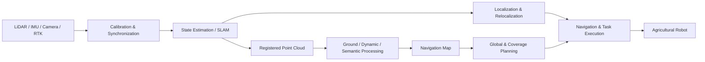

<h1 align="center">Hi, I'm Xuan Yang 👋</h1>

  <strong>Agricultural Robotics · Autonomous Navigation · SLAM & Mapping · Robotics Systems</strong>

  
  
  
  

  <a href="#about--关于我">About / 关于我</a> ·
  <a href="#featured-projects--主要项目">Projects / 项目</a> ·
  <a href="#technical-stack--技术栈">Stack / 技术栈</a> ·
  <a href="#github-activity">GitHub Stats</a>

---

## About / 关于我

I'm an **Agricultural Machinery and Automation** student at **South China Agricultural University**, working on autonomous systems for agricultural robots.

我是 **华南农业大学农业机械化及其自动化专业** 学生，目前主要围绕农业机器人的自主导航、环境感知与机器人系统集成开展开发与研究。

My current focus is not just on isolated SLAM, mapping or planning algorithms, but on building **complete, reproducible and deployable robot navigation pipelines** for structured and semi-structured agricultural environments such as greenhouses, orchards and crop rows.

相比把 SLAM、建图、规划和控制作为彼此独立的模块，我更关注如何将它们组织成一套能够在温室、果园和田间行道等真实农业环境中稳定运行、可复现实验并持续迭代的完整机器人系统。

### Current Focus / 当前方向

- 🤖 **Agricultural mobile robotics / 农业移动机器人**
- 🧭 **Autonomous navigation & task execution / 自主导航与任务执行**
- 🗺️ **LiDAR–IMU SLAM, localization & relocalization / 激光惯性 SLAM、定位与重定位**
- ☁️ **Point-cloud processing & navigation maps / 点云处理与导航地图生成**
- 🌱 **Greenhouse & field environment understanding / 温室与田间环境理解**
- 🛣️ **Global route & coverage planning / 全局路径与覆盖路径规划**
- 🧪 **Reproducible robotics benchmarking / 可复现机器人实验与算法评测**
- 🔧 **ROS 2 integration & real-robot deployment / ROS 2 系统集成与实机部署**

---

## System View / 系统视角

  <strong>Sensors → State Estimation → Mapping → Environment Understanding → Planning → Navigation → Robot Tasks</strong> 
  <strong>传感器 → 状态估计 → 建图 → 环境理解 → 路径规划 → 自主导航 → 机器人任务</strong>

---

## Featured Projects / 主要项目

> Status badges describe the **current role and development focus** of each repository, not a production-readiness guarantee.  
> 状态标签用于表示仓库当前的角色与开发重点，并不等同于正式发布或生产级稳定性声明。

| Project | Status | What it does / 项目定位 |
|---|---|---|
| **[agt_navigation_v2](https://github.com/Aldoubt/agt_navigation_v2)** |  | Modular ROS 2 agricultural navigation system covering map processing, localization, planning and task-oriented navigation / 模块化 ROS 2 农业机器人导航系统 |
| **[lio_benchmark_tools](https://github.com/Aldoubt/lio_benchmark_tools)** |  | Reproducible LiDAR–IMU odometry benchmark framework with unified datasets and evaluation / 可复现 LIO 算法评测框架 |
| **[lidar-static-map-benchmark](https://github.com/Aldoubt/lidar-static-map-benchmark)** |  | Static navigation-map generation and point-cloud preprocessing benchmark / 静态导航地图生成与点云预处理评测 |
| **[ground_segmentation_benchmark](https://github.com/Aldoubt/ground_segmentation_benchmark)** |  | Unified comparison of greenhouse ground-segmentation algorithms / 温室场景地面分割算法统一评测 |
| **[fastlivo2_platform](https://github.com/Aldoubt/fastlivo2_platform)** |  | MID360 + industrial camera + FAST-LIVO2 integration and deployment platform / FAST-LIVO2 多传感器集成与部署平台 |
| **[FAST-Calib-ROS2](https://github.com/Aldoubt/FAST-Calib-ROS2)** |  | ROS 2 LiDAR–camera extrinsic calibration workflow / ROS 2 激光雷达—相机外参标定工具链 |
| **[rosbag_sensor_trimmer](https://github.com/Aldoubt/rosbag_sensor_trimmer)** |  | ROS 2 multi-sensor dataset trimming and preprocessing utility / ROS 2 多传感器数据集裁剪与预处理工具 |

---

## Research & Engineering / 研究与工程方向

### 🧭 Autonomous Navigation / 自主导航

`Nav2` · `Behavior Trees` · `Global Planning` · `Coverage Planning` · `Ackermann Robots`

Building the navigation chain from offline route generation and vehicle constraints to online localization, path tracking and task execution.

从离线路线生成、车辆运动学约束，到在线定位、轨迹跟踪和任务执行，构建完整的自主导航链路。

### 🗺️ SLAM & Localization / SLAM 与定位

`FAST-LIO2` · `FAST-LIVO2` · `ICP` · `NDT` · `GTSAM`

LiDAR–IMU odometry, global localization, relocalization, trajectory evaluation and robust operation in repetitive agricultural geometry.

关注激光惯性里程计、全局定位、重定位、轨迹评估以及重复结构农业环境中的鲁棒自主运行。

### ☁️ Point Cloud & Mapping / 点云与地图

`PCL` · `Open3D` · `OccupancyGrid` · `PCD` · `OctoMap`

Ground segmentation, point-cloud filtering, semantic map construction and 2D / 2.5D navigation-map generation.

研究地面分割、点云过滤、语义地图构建，以及从三维点云生成 2D / 2.5D 导航地图。

### 🧪 Reproducible Robotics / 可复现机器人实验

`rosbag2` · `EVO` · `Docker` · `GitHub Actions`

Recording datasets, parameters, software versions, hardware environments and failure cases so experiments can be reproduced and compared.

记录数据集、参数、软件版本、硬件环境与失败案例，让机器人实验能够复现、对比并持续迭代。

---

## Technical Stack / 技术栈

| Area | Stack |
|---|---|
| **Robotics & Middleware** | `ROS 2 Humble` `Nav2` `TF2` `rosbag2` `RViz2` `Gazebo` |
| **SLAM & State Estimation** | `FAST-LIO2` `FAST-LIVO2` `GTSAM` `ICP` `NDT` `Sophus` |
| **Perception & Mapping** | `PCL` `OpenCV` `Open3D` `OctoMap` `OccupancyGrid` |
| **Development** | `C++17` `Python` `CMake` `Eigen` `Docker` `Git` `GitHub Actions` |
| **Sensors & Platforms** | `Livox MID360` `Camera` `IMU` `RTK` `BUNKER` `Ackermann Chassis` |

---

## Current Work / 正在推进

- **Greenhouse navigation pipeline** — reproducible mapping, localization and navigation for real agricultural robots  
  **温室自主导航链路** —— 打通可复现建图、定位与实机导航

- **Navigation-map generation** — ground filtering, static-map construction, semantic areas and route-ready map outputs  
  **导航地图生成** —— 地面处理、静态地图、语义区域与可规划地图输出

- **Vehicle-aware route planning** — offline global routes with chassis geometry and kinematic constraints  
  **车型约束路径规划** —— 将底盘尺寸与运动学约束纳入离线全局路线生成

- **LIO benchmarking** — unified ROS 2 bag datasets, algorithm adapters and trajectory evaluation  
  **LIO 算法评测** —— 统一 ROS 2 Bag、算法适配与轨迹评价流程

---

## GitHub Activity

  
  

GitHub cards summarize public repository activity and repository-language statistics; they are not a ranking of technical proficiency.

---

## Engineering Principles / 工程理念

- **Separate reusable algorithms from robot-specific integration** / 通用算法与具体机器人适配解耦
- **Record datasets, parameters, versions and hardware environments** / 记录数据、参数、版本与硬件环境
- **Distinguish implemented features from experimentally verified results** / 区分“已经实现”和“实验验证通过”
- **Prefer reproducible offline validation before real-robot deployment** / 实机部署前优先建立可复现的离线验证
- **Record failure cases, not only successful demos** / 不只展示成功 Demo，也记录失效模式和边界条件

---

## Contact / 联系

For technical discussions, collaboration or reproducibility questions, feel free to open an **Issue** or **Discussion** in the corresponding repository.

如果希望讨论技术问题、项目合作或实验复现，可以直接在对应仓库提交 **Issue** 或参与 **Discussion**。
